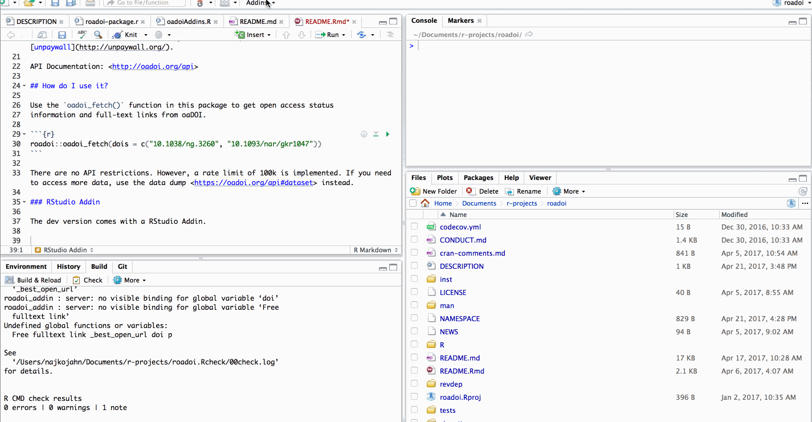

# roadoi - Use Unpaywall with R


[](https://github.com/ropensci/roadoi/actions)
[](https://travis-ci.org/ropensci/roadoi)
[](https://ci.appveyor.com/project/ropensci/roadoi)
[](https://codecov.io/github/ropensci/roadoi?branch=master)
[](https://cran.r-project.org/package=roadoi)
[](https://github.com/r-hub/cranlogs.app)
[](https://github.com/ropensci/software-review/issues/115)


roadoi interacts with the [Unpaywall API](https://unpaywall.org/products/api), 
a simple web-interface which links DOIs and open access versions of scholarly works. 
The API powers [Unpaywall](https://unpaywall.org/).

This client supports the most recent API Version 2.

API Documentation: <https://unpaywall.org/products/api>

## How do I use it? 

Use the `oadoi_fetch()` function in this package to get open access status
information and full-text links from Unpaywall.


```r
roadoi::oadoi_fetch(dois = c("10.1038/ng.3260", "10.1093/nar/gkr1047"), 
                    email = "najko.jahn@gmail.com")
#> # A tibble: 2 x 21
#>   doi   best_oa_location oa_locations oa_locations_em… data_standard is_oa
#>   <chr> <list>           <list>       <list>                   <int> <lgl>
#> 1 10.1… <tibble [1 × 11… <tibble [1 … <tibble [0 × 0]>             2 TRUE 
#> 2 10.1… <tibble [1 × 10… <tibble [7 … <tibble [0 × 0]>             2 TRUE 
#> # … with 15 more variables: is_paratext <lgl>, genre <chr>, oa_status <chr>,
#> #   has_repository_copy <lgl>, journal_is_oa <lgl>, journal_is_in_doaj <lgl>,
#> #   journal_issns <chr>, journal_issn_l <chr>, journal_name <chr>,
#> #   publisher <chr>, published_date <chr>, year <chr>, title <chr>,
#> #   updated_resource <chr>, authors <list>
```

There are no API restrictions. However, providing an email address is required and a rate limit of 100k is suggested. If you need to access more data, use the [data dump](https://unpaywall.org/products/snapshot) instead.

### RStudio Addin

This package also has a RStudio Addin for easily finding free full-texts in RStudio.



## How do I get it? 

Install and load from [CRAN](https://cran.r-project.org/package=roadoi):


```r
install.packages("roadoi")
library(roadoi)
```

To install the development version, use the [devtools package](https://cran.r-project.org/package=devtools)


```r
devtools::install_github("ropensci/roadoi")
library(roadoi)
```

## Long-Form Documentation including use-case


Open access copies of scholarly publications are sometimes hard to find. Some are published in open access journals. Others are made freely available as preprints before publication, and others are deposited in institutional repositories, digital archives maintained by universities and research institutions. This document guides you to roadoi, a R client that makes it easy to search for these open access copies by interfacing the [ourresearch](https://ourresearch.org//) service where DOIs are matched with freely available full-texts available from open access journals and archives.

### About Unpaywall

[Unpaywall](https://unpaywall.org/), developed and maintained by the [team of ourresearch](https://ourresearch.org/team/about), is a non-profit service that finds open access copies of scholarly literature simply by looking up a DOI (Digital Object Identifier). It not only returns open access full-text links, but also helpful metadata about the open access status of a publication such as licensing or provenance information.

Unpaywall uses different data sources to find open access full-texts including:

- [Crossref](https://www.crossref.org/): a DOI registration agency serving major scholarly publishers.
- [Directory of Open Access Journals (DOAJ)](https://doaj.org/): a registry of open access journals
- Various OAI-PMH metadata sources. OAI-PMH is a protocol often used by open access journals and repositories such as arXiv and PubMed Central.

See [Piwowar et al. (2018)](https://doi.org/10.7717/peerj.4375) for a comprehensive overview of Unpaywall.

### Basic usage

There is one major function to talk with Unpaywall, `oadoi_fetch()`, taking a character vector of DOIs and your email address as required arguments.


```r
library(roadoi)
roadoi::oadoi_fetch(dois = c("10.1186/s12864-016-2566-9",
                             "10.1103/physreve.88.012814"), 
                    email = "najko.jahn@gmail.com")
#> # A tibble: 2 x 21
#>   doi   best_oa_location oa_locations oa_locations_em… data_standard is_oa
#>   <chr> <list>           <list>       <list>                   <int> <lgl>
#> 1 10.1… <tibble [1 × 10… <tibble [6 … <tibble [0 × 0]>             2 TRUE 
#> 2 10.1… <tibble [1 × 10… <tibble [2 … <tibble [0 × 0]>             2 TRUE 
#> # … with 15 more variables: is_paratext <lgl>, genre <chr>, oa_status <chr>,
#> #   has_repository_copy <lgl>, journal_is_oa <lgl>, journal_is_in_doaj <lgl>,
#> #   journal_issns <chr>, journal_issn_l <chr>, journal_name <chr>,
#> #   publisher <chr>, published_date <chr>, year <chr>, title <chr>,
#> #   updated_resource <chr>, authors <list>
```

#### What's returned?

The client supports API version 2. According to the [Unpaywall Data Format](http://unpaywall.org/data-format), the following variables with the following definitions are returned:

**Column**|**Description**
|:------------|:----------------------------------------------
`doi`|DOI (always in lowercase)
`best_oa_location`|list-column describing the best OA location. Algorithm prioritizes publisher hosted content (e.g. Hybrid or Gold)
`oa_locations`|list-column of all the OA locations. 
`oa_locations_embargoed` | list-column of locations expected to be available in the future based on information like license metadata and journals' delayed OA policies
`data_standard`|Indicates the data collection approaches used for this resource. `1` mostly uses Crossref for hybrid detection. `2` uses more comprehensive hybrid detection methods. 
`is_oa`|Is there an OA copy (logical)? 
`is_paratext`| Is the item an ancillary part of a journal, like a table of contents? See here for more information <https://support.unpaywall.org/support/solutions/articles/44001894783>. 
`genre`|Publication type
`oa_status`|Classifies OA resources by location and license terms as one of: gold, hybrid, bronze, green or closed. See here for more information <https://support.unpaywall.org/support/solutions/articles/44001777288-what-do-the-types-of-oa-status-green-gold-hybrid-and-bronze-mean->.
`has_repository_copy`|Is a full-text available in a repository?
`journal_is_oa`|Is the article published in a fully OA journal? Uses the Directory of Open Access Journals (DOAJ) as source. 
`journal_is_in_doaj`|Is the journal listed in the Directory of Open Access Journals (DOAJ).
`journal_issns`|ISSNs, i.e. unique code to identify journals.
`journal_issn_l`|Linking ISSN.
`journal_name`|Journal title
`publisher`|Publisher
`published_date`|Date published
`year`|Year published. 
`title`|Publication title. 
`updated_resource`|Time when the data for this resource was last updated. 
`authors`|Lists authors (if available)

The columns  `best_oa_location` and  `oa_locations` are list-columns that contain useful metadata about the OA sources found by Unpaywall These are

**Column**|**Description**
|:------------|:----------------------------------------------
`endpoint_id`|Unique repository identifier
`evidence`|How the OA location was found and is characterized by Unpaywall?
`host_type`|OA full-text provided by `publisher` or `repository`. 
`is_best`|Is this location the \code{best_oa_location} for its resource?
`license`|The license under which this copy is published
`oa_date`|When this document first became available at this location
`pmh_id`|OAI-PMH endpoint where we found this location
`repository_institution`|Hosting institution of the repository.
`updated`|Time when the data for this location was last updated
`url`|The URL where you can find this OA copy.
`url_for_landing_page`| The URL for a landing page describing this OA copy.
`url_for_pdf`|The URL with a PDF version of this OA copy.
`versions`|The content version accessible at this location following the DRIVER 2.0 Guidelines  (<https://wiki.surfnet.nl/display/DRIVERguidelines/DRIVER-VERSION+Mappings>)

The Unpaywall schema is also described here: <https://unpaywall.org/data-format>.

The columns  `best_oa_location`. `oa_locations` and `oa_locations_embargoed` are list-columns that contain useful metadata about the OA sources found by Unpaywall. 

If `.flatten = TRUE` the list-column `oa_locations` will be restructured in a long format where each OA fulltext is represented by one row, which allows to take into account all OA locations found by Unpaywall in a data analysis.


```r
library(dplyr)
roadoi::oadoi_fetch(dois = c("10.1186/s12864-016-2566-9",
                             "10.1103/physreve.88.012814",
                             "10.1093/reseval/rvaa038",
                             "10.1101/2020.05.22.111294",
                             "10.1093/bioinformatics/btw541"), 
                    email = "najko.jahn@gmail.com", .flatten = TRUE) %>%
  dplyr::count(is_oa, evidence, is_best) 
#> # A tibble: 8 x 4
#>   is_oa evidence                                       is_best     n
#>   <lgl> <chr>                                          <lgl>   <int>
#> 1 FALSE <NA>                                           NA          1
#> 2 TRUE  oa journal (via doaj)                          FALSE       1
#> 3 TRUE  oa repository (semantic scholar lookup)        FALSE       1
#> 4 TRUE  oa repository (via OAI-PMH doi match)          FALSE       7
#> 5 TRUE  oa repository (via page says license)          TRUE        1
#> 6 TRUE  oa repository (via pmcid lookup)               FALSE       2
#> 7 TRUE  open (via crossref license, author manuscript) TRUE        1
#> 8 TRUE  open (via page says license)                   TRUE        2
```


#### Any API restrictions?

There are no API restrictions. However, Unpaywall requires an email address when using its API. If you are too tired to type in your email address every time, you can store the email  in the `.Renviron` file with the option `roadoi_email` 

```
roadoi_email = "najko.jahn@gmail.com"
```

You can open your `.Renviron` file calling 

```r
file.edit("~/.Renviron")`
```

Save the file and restart your R session. To stop sharing the email when using roadoi, delete it from your `.Renviron` file.

#### Keeping track of crawling

To follow your API call, and to estimate the time until completion, use the `.progress` parameter inherited from `plyr` to display a progress bar.


```r
roadoi::oadoi_fetch(dois = c("10.1186/s12864-016-2566-9",
                             "10.1103/physreve.88.012814"), 
                    email = "najko.jahn@gmail.com", 
                    .progress = "text")
#> 
  |                                                                            
  |                                                                      |   0%
  |                                                                            
  |===================================                                   |  50%
  |                                                                            
  |======================================================================| 100%
#> # A tibble: 2 x 21
#>   doi   best_oa_location oa_locations oa_locations_em… data_standard is_oa
#>   <chr> <list>           <list>       <list>                   <int> <lgl>
#> 1 10.1… <tibble [1 × 10… <tibble [6 … <tibble [0 × 0]>             2 TRUE 
#> 2 10.1… <tibble [1 × 10… <tibble [2 … <tibble [0 × 0]>             2 TRUE 
#> # … with 15 more variables: is_paratext <lgl>, genre <chr>, oa_status <chr>,
#> #   has_repository_copy <lgl>, journal_is_oa <lgl>, journal_is_in_doaj <lgl>,
#> #   journal_issns <chr>, journal_issn_l <chr>, journal_name <chr>,
#> #   publisher <chr>, published_date <chr>, year <chr>, title <chr>,
#> #   updated_resource <chr>, authors <list>
```


### Use Case: Studying the compliance with open access policies

An increasing number of universities, research organisations and funders have launched open access policies in recent years. Using roadoi together with other R-packages makes it easy to examine how and to what extent researchers comply with these policies in a reproducible and transparent manner. In particular, the [rcrossref package](https://github.com/ropensci/rcrossref), maintained by rOpenSci, provides many helpful functions for this task.

#### Gathering DOIs representing scholarly publications

DOIs have become essential for referencing scholarly publications, and thus many digital libraries and institutional databases keep track of these persistent identifiers. For the sake of this vignette, instead of starting with a pre-defined set of publications originating from these sources, we simply generate a random sample of 50 DOIs registered with Crossref by using the [rcrossref package](https://github.com/ropensci/rcrossref).


```r
library(dplyr)
library(rcrossref)
# get a random sample of DOIs and metadata describing these works
random_dois <- rcrossref::cr_r(sample = 50)
```

#### Calling Unpaywall

Now let's call Unpaywall:


```r
oa_df <- roadoi::oadoi_fetch(random_dois, 
                             email = "najko.jahn@gmail.com")
```

#### Reporting

After obtaining the data, reporting with R is straightforward. You can even generate dynamic reports using [R Markdown](http://rmarkdown.rstudio.com/) and related packages, thus making your study reproducible and transparent.

To display how many full-text links were found and which sources were used in a nicely formatted markdown-table using the [`knitr`](https://yihui.name/knitr/)-package:


```r
oa_df %>%
  group_by(is_oa) %>%
  summarise(Articles = n()) %>%
  mutate(Proportion = Articles / sum(Articles)) %>%
  arrange(desc(Articles)) %>%
  knitr::kable()
```


|is_oa | Articles| Proportion|
|:-----|--------:|----------:|
|FALSE |       31|       0.62|
|TRUE  |       19|       0.38|

How did Unpaywall find those Open Access full-texts, which were characterized as best matches, and how are these OA types distributed over publication types?


```r
if(!is.null(oa_df))
oa_df %>%
  filter(is_oa == TRUE) %>%
  select(best_oa_location, oa_status, genre) %>%
  tidyr::unnest(best_oa_location) %>% 
  group_by(oa_status, evidence, genre) %>%
  summarise(Articles = n()) %>%
  arrange(desc(Articles)) %>%
  knitr::kable()
```


|oa_status |evidence                                                 |genre               | Articles|
|:---------|:--------------------------------------------------------|:-------------------|--------:|
|bronze    |open (via free pdf)                                      |journal-article     |        5|
|gold      |oa journal (via publisher name)                          |component           |        2|
|gold      |open (via page says license)                             |journal-article     |        2|
|green     |oa repository (via OAI-PMH doi match)                    |journal-article     |        2|
|green     |oa repository (via OAI-PMH title and first author match) |journal-article     |        2|
|hybrid    |open (via free pdf)                                      |journal-article     |        2|
|hybrid    |open (via page says license)                             |journal-article     |        2|
|green     |oa repository (semantic scholar lookup)                  |journal-article     |        1|
|green     |oa repository (semantic scholar lookup)                  |proceedings-article |        1|

#### More examples

For more  examples, see Piwowar et al. 2018. Together with the article, the authors shared their analysis of Unpaywall Data as [R Markdown supplement](https://github.com/ourresearch/oadoi-paper1).

This blog post describes how to analyze the Unpaywall data dump with R: <https://subugoe.github.io/scholcomm_analytics/posts/unpaywall_evidence/>

### References 

Piwowar, H., Priem, J., Larivière, V., Alperin, J. P., Matthias, L., Norlander, B., … Haustein, S. (2018). The state of OA: a large-scale analysis of the prevalence and impact of Open Access articles. PeerJ, 6, e4375. <https://doi.org/10.7717/peerj.4375>

## Meta

Please note that this project is released with a [Contributor Code of Conduct](https://github.com/ropensci/roadoi/blob/master/CONDUCT.md). By participating in this project you agree to abide by its terms.

License: MIT

Please use the [issue tracker](https://github.com/ropensci/roadoi/issues) for bug reporting and feature requests.

[](https://ropensci.org)
